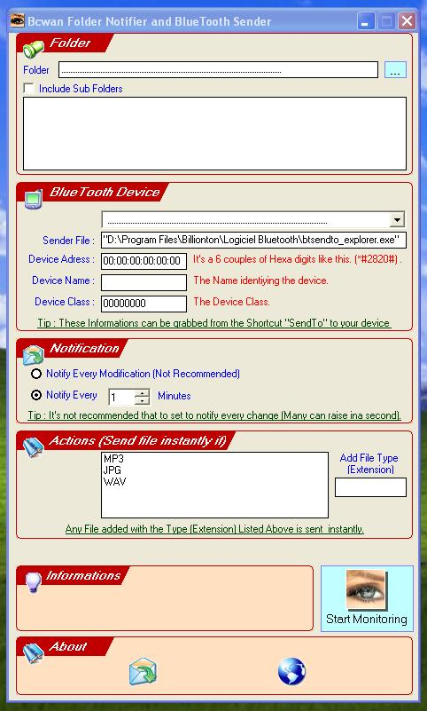



## BcwanBlue

### Description

This is an application to monitor a folder for changes (exmple Downloaded files) and send those changes as notifications to a BlueTooth built-in device like Mobiles and Pocket Pcs.

(the built in BlueTooth on the device must be to work).

Now add a ComboBox to deal with requested devices informations to send to.

Have Fun with this application which I want to share it with you all.

- it allow to monitor a folder for changes (Add, Delete, Rename files and more).

- can monitor the sub folders too.

- it Allow to send those changes to any device with BlueTooth.

- whenever a change is made or

- by indicating a laps of times (minutes) to send changes.

- it allow to send some types of files instantly.

those types can be customized (add, remove, ...), can be enlarged to more file Types.

- Easily change properties of the device to allow sending notifications to many devices.

- Save and restore device and folder informations, set them once.

- Can be minimized to tray icon to operate silently.

- Ability to select the monitored folder by Select folder control.

- Now add a ComboBox listing all registered BlueTooth Devices on Pc, (to grab informations about devices easily).

I think that's not all but have a look on the Code.

Have Fun and let me know your suggestions, any suggestion is welcome, Votes too ...
 
### More Info
 

             |
---                |---
**Submitted On**   |2006-03-12 16:07:12
**By**             |[BIDA  Chikh](https://github.com/Planet-Source-Code/PSCIndex/blob/master/ByAuthor/bida-chikh.md)
**Level**          |Advanced
**User Rating**    |5.0 (10 globes from 2 users)
**Compatibility**  |VB 6\.0
**Category**       |[Complete Applications](https://github.com/Planet-Source-Code/PSCIndex/blob/master/ByCategory/complete-applications__1-27.md)
**World**          |[Visual Basic](https://github.com/Planet-Source-Code/PSCIndex/blob/master/ByWorld/visual-basic.md)
**Archive File**   |[BcwanBlue1980433162006\.zip](https://github.com/Planet-Source-Code/bida-chikh-bcwanblue__1-64615/archive/master.zip)

